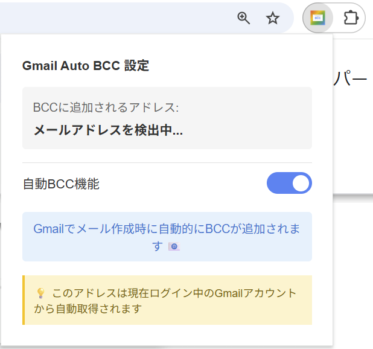
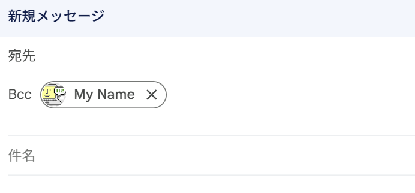

# Gmail Auto BCC

Gmail で新規メールを作成する際に、自動的に BCC に自分のメールアドレスを追加する Chrome 拡張機能です。


## 📋 機能

- ✅ **新規メール作成時に自動BCC追加**: 「作成」ボタンをクリックすると、自動的にBCCフィールドに自分のメールアドレスが追加されます
- ✅ **返信・転送時の手動サポート**: BCCリンクをクリックすると、自動的にメールアドレスが入力されます
- ✅ **有効/無効の切り替え**: 拡張機能アイコンから簡単にON/OFF可能
- ✅ **重複入力防止**: 既にBCCに追加されている場合は再入力しません


## 📸 スクリーンショット

### ポップアップ画面




### 新規メール作成画面




## 🚀 インストール方法

### Chrome Web Storeからインストール（公開後）

1. [Chrome Web Store](#)にアクセス（準備中）
2. 「Chromeに追加」をクリック

### 手動インストール（開発版）

1. このリポジトリをクローンまたはダウンロード
```bash
git clone https://github.com/yourusername/gmail-auto-bcc.git
```

2. Chrome で `chrome://extensions/` を開く

3. 右上の「デベロッパーモード」をONにする

4. 「パッケージ化されていない拡張機能を読み込む」をクリック

5. ダウンロードしたフォルダを選択


## 📖 使い方

### 新規メール作成

1. Gmail を開く
2. 「作成」ボタンをクリック
3. 自動的にBCCフィールドに自分のメールアドレスが追加されます ✨

### 返信・転送

1. メールの「返信」または「転送」ボタンをクリック
2. 手動で「Bcc」リンクをクリック**（※返信・転送ウィンドウ表示時、自動的にはセットされません）**
3. 自動的にメールアドレスが入力されます ✨

### 有効/無効の切り替え

1. ブラウザのツールバーにある拡張機能アイコンをクリック
2. トグルスイッチでON/OFFを切り替え


## 🛠️ 技術スタック

- **Manifest V3**: 最新のChrome拡張機能仕様
- **Vanilla JavaScript**: フレームワーク不使用でシンプルに実装
- **Chrome Storage API**: 設定の保存


## 🔒 プライバシー

この拡張機能は：
- ✅ メールアドレスをローカルストレージにのみ保存
- ✅ 外部サーバーへのデータ送信なし
- ✅ メール内容へのアクセスなし
- ✅ 最小限の権限のみ使用


## 🤝 コントリビューション

プルリクエストを歓迎します！


## 📝 ライセンス

[MIT License](LICENSE)


## 👤 作者

[@sukunabicco](https://github.com/sukunabicco)


## 🐛 バグ報告・機能リクエスト

[Issues](https://github.com/yourusername/gmail-auto-bcc/issues)からお願いします。


## 📮 サポート

質問がある場合は、[Discussions](https://github.com/yourusername/gmail-auto-bcc/discussions)でお気軽にどうぞ。

---

⭐ このプロジェクトが役に立った場合は、スターをつけていただけると嬉しいです！

